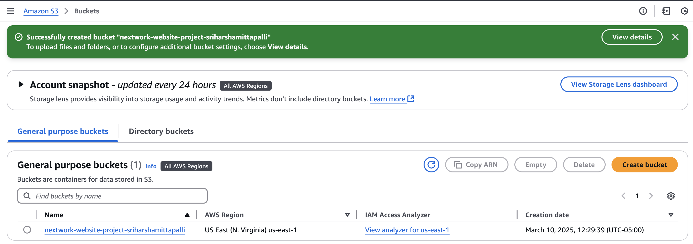
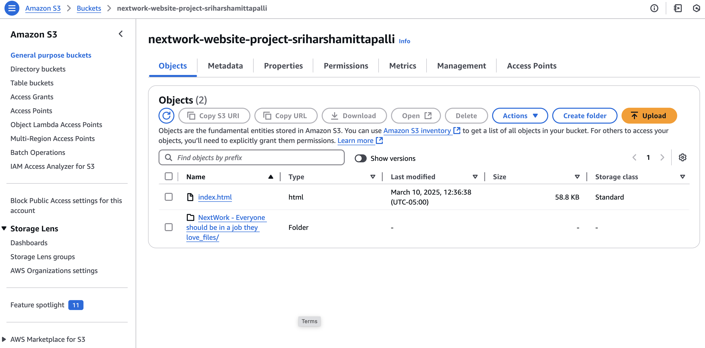
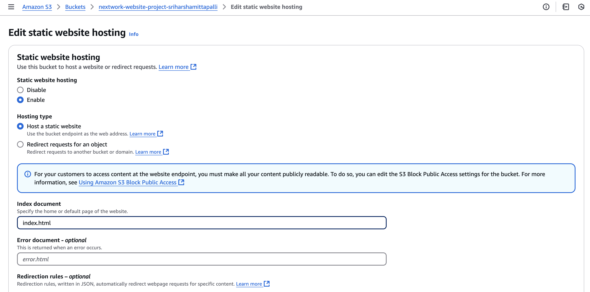
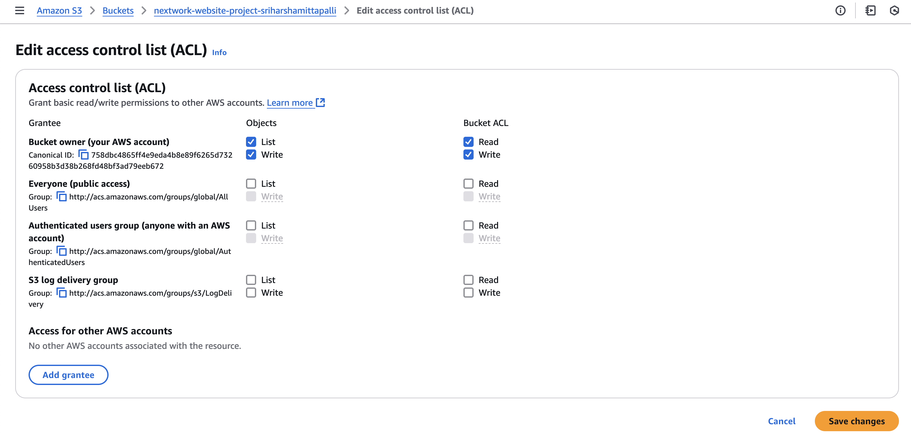
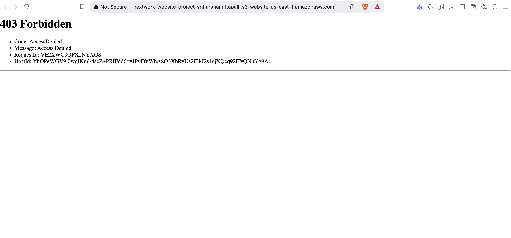
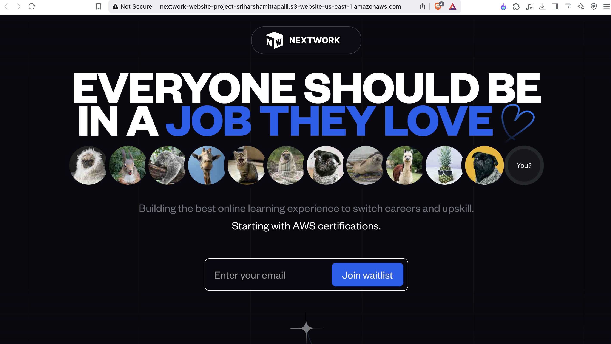

# 🌐 Host a Website on Amazon S3

This project demonstrates how to host a static website using **Amazon S3 (Simple Storage Service)**.  
Amazon S3 is a cloud storage service that lets you store and retrieve any amount of data.

---

## 📌 Project Overview

In this project, I used Amazon S3 to host a static website by:
- Uploading HTML and supporting files
- Enabling **Static Website Hosting**
- Making the content publicly accessible via the bucket’s endpoint URL

### 📝 One Thing I Didn't Expect
I encountered an **Access Denied error** even after uploading the files due to incorrect bucket or object permission settings.

### ⏱ Project Duration
This project took around **45 minutes**, including:
- Uploading files  
- Configuring permissions  
- Enabling static website hosting  
- Troubleshooting access issues

---

## 🪣 How I Set Up an S3 Bucket

- Created a new **S3 Bucket**
- Chose **US East (N. Virginia)** as the region for low latency and cost-effectiveness

> 🔸 **Note:** S3 bucket names must be globally unique!

### 📸 Screenshot: *S3 Bucket Creation*

---

## 📤 Upload Website Files to S3

- Uploaded:
  - `index.html`
  - A folder containing all images, HTML, and JavaScript files

These files are essential:
- **index.html** – the main entry point for the website
- **Supporting files** – for full website functionality

### 📸 Screenshot: *File Upload*

---

## 🌍 Static Website Hosting on S3

Enabled **Static Website Hosting** by:
- Navigating to **Bucket > Properties > Static Website Hosting**
- Setting `index.html` as the default document

### 📸 Screenshot: *Static Website Hosting Configuration*

### 🔐 Permissions & ACLs
- Updated **ACL settings** to make the bucket and objects publicly accessible

### 📸 Screenshot: *Public Permissions Settings*

---

## 🔗 Bucket Endpoint

Once hosting is enabled, a **bucket endpoint URL** is generated:

> ⚠️ Initially, an **Access Denied error** occurred because the public permissions were missing.

### 📸 Screenshot: *Access Denied Error*

---

## ✅ Success!

After updating the permissions:
- Made `index.html` and the supporting folder **public**
- The website is now successfully hosted and accessible via the S3 endpoint

### 📸 Screenshot: *Website Live View*

---
